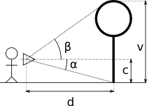
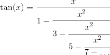
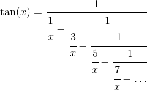

# IZP - Základy programování

## Projekt 2 - Iterační výpočty


## Popis projektu
Implementujte výpočet vzdálenosti a výšky měřeného objektu pomocí údajů ze senzorů natočení měřicího přístroje. Výpočet proveďte pouze pomocí matematických operací ```+,-,*,/```.



### Detailní specifikace

#### Překlad a odevzdání zdrojového souboru

**Odevzdání:** Program implementujte ve zdrojovém souboru proj2.c. Zdrojový soubor odevzdejte prostřednictvím informačního systému.

**Překlad:** Program překládejte s následujícími argumenty:

```
$ gcc -std=c99 -Wall -Wextra -pedantic proj2.c -lm -o proj2
```

#### Syntax spuštění

Program se spouští v následující podobě:

```
./proj2 --help
nebo
./proj2 --tan A N M
nebo
./proj2 [-c X] -m A [B]
```

**Argumenty programu:**

* --help způsobí, že program vytiskne nápovědu používání programu a skončí.
* --tan srovná přesnosti výpočtu tangens úhlu A (v radiánech) mezi voláním tan z matematické knihovny, a výpočtu tangens pomocí Taylorova polynomu a zřetězeného zlomku. Argumenty N a M udávají, ve kterých iteracích iteračního výpočtu má srovnání probíhat. 0 < N <= M < 14
* -m vypočítá a změří vzdálenosti.
	* Úhel α (viz obrázek) je dán argumentem A v radiánech. Program vypočítá a vypíše vzdálenost měřeného objektu. 0 < A <= 1.4 < π/2.
	* Pokud je zadán, úhel β udává argument B v radiánech. Program vypočítá a vypíše i výšku měřeného objektu. 0 < B <= 1.4 < π/2
	* Argument -c nastavuje výšku měřicího přístroje c pro výpočet. Výška c je dána argumentem X (0 < X <= 100). Argument je volitelný - implicitní výška je 1.5 metrů.

### Implementační detaily

Je zakázané použít funkce z matematické knihovny. Jedinou výjimkou je funkce tan použitá pouze pro srovnání výpočtů, funkce isnan a isinf a konstanty NAN a INF. Ve všech výpočtech používejte typ double. Uvažujte přesnost na 10 míst. Počet iterací v iteračních výpočtech odvoďte.

#### Implementace tangens

Funkci tangens implementujte dvakrát a to pomocí Taylorova polynomu a zřetězených zlomků.

### 1. podúkol

Tangens pomocí Taylorova polynomu implementujte ve funkci s prototypem:

```
double taylor_tan(double x, unsigned int n);
```

kde x udává úhel a n rozvoj polynomu (počet členů). Taylorův polynom pro funkci tangens vypadá následovně:


přičemž řada čitatelů ve zlomcích koeficientů je zde a řada jmenovatelů ve zlomcích koeficientů je zde. Ve svém programu použijte pouze 13 prvních koeficientů.

### 2. podúkol

Tangens pomocí zřetězených zlomků (viz demonstrační cvičení) implementujte ve funkci s prototypem:

```
double cfrac_tan(double x, unsigned int n);
```

kde x udává úhel a n rozvoj zřetězeného zlomku:



nebo



#### Srovnání přesnosti výpočtu tangens

Srovnání iteračních a zabudovaných výpočtů realizujte pro zadaný počet iterací. Výstup srovnání bude v podobě řádků obsahující následující:

```
I M T TE C CE
```

(odpovídající formátu "%d %e %e %e %e %e\n"), kde:

* I značí počet iterací iteračního výpočtu,
* M výsledek z funkce tan matematické knihovny,
* T výsledek z funkce taylor_tan,
* TE absolutní chybu mezi výpočtem pomocí Taylorova polynomu a matematickou knihovnou,
* C výsledek z funkce cfrac_tan a
* CE absolutní chybu mezi výpočtem pomocí zřetězených zlomků a matematickou knihovnou.

Počet iterací udává interval daný argumenty programu <N;M>. Výstup programu tedy bude obsahovat N-M+1 řádků. První řádek tedy začíná číslem N.

#### Měření

Pro měření vzdálenosti a výšky použijte vámi implementovanou funkci cfrac_tan.

V případě zadaného úhlu α i β vypište dvě čísla odpovídající délce d a výšce v (v tomto pořadí). Oba číselné údaje vypisujte formátovaným výstupem pomocí "%.10e", každý údaj samostatně na jeden řádek.

#### Příklady vstupů a výstupů

Číselné údaje nemusí odpovídat vaší implementaci. Výsledek závisí na způsobu implementace a optimalizaci.

```
$ ./proj2 --tan 1.024 6 10
6 1.642829e+00 1.634327e+00 8.502803e-03 1.642829e+00 3.298801e-09
7 1.642829e+00 1.639216e+00 3.613451e-03 1.642829e+00 1.794520e-11
8 1.642829e+00 1.641294e+00 1.535615e-03 1.642829e+00 7.460699e-14
9 1.642829e+00 1.642177e+00 6.525932e-04 1.642829e+00 4.440892e-16
10 1.642829e+00 1.642552e+00 2.773337e-04 1.642829e+00 0.000000e+00
```

```
$ ./proj2 -m 0.3 0.9
4.8490922156e+00
7.6106234032e+00
```

```
$ ./proj2 -c 1.7 -m 0.15 1.3
1.1248205560e+01
4.2217188781e+01
```
#### Hodnocení

Na výsledném hodnocení mají hlavní vliv následující faktory:

* implementace algoritmických schemat pro iterační výpočty,
* volba funkcí a jejich parametrů pro výpočet měřených veličin,
* výpočet tangens a srovnání přesnosti,
* výpočet vzdálenosti a výšky,
* ošetření neočekávaných stavů.
