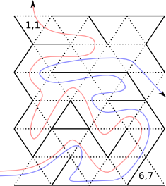

# IZP - Základy programování

## Projekt 3 - Průchod bludištěm

#### Popis projektu

Vytvořte program, který v daném bludišti a jeho vstupu najde průchod ven. Bludiště je uloženo v textovém souboru ve formě obdélníkové matice celých čísel. Cílem programu je výpis souřadnic políček bludiště, přes které vede cesta z vchodu bludiště do jeho východu.

### Detailní specifikace

#### Překlad a odevzdání zdrojového souboru

**Odevzdání:** Program implementujte ve zdrojovém souboru proj3.c. Zdrojový soubor odevzdejte prostřednictvím informačního systému.

**Překlad:** Pro vyzkoušení překládejte program s následujícími argumenty

```
$ gcc -std=c99 -Wall -Wextra -pedantic proj3.c -o proj3
```

#### Syntax spuštění

Program se spouští v následující podobě:

```
./proj3 --help
nebo
./proj3 --test soubor.txt
nebo
./proj3 --rpath R C bludiste.txt
nebo
./proj3 --lpath R C bludiste.txt
nebo (nepovinné, prémiové)
./proj3 --shortest R C bludiste.txt
```

#### Argumenty programu:

* --help způsobí, že program vytiskne nápovědu používání programu a skončí.
* --test pouze zkontroluje, že soubor daný druhým argumentem programu obsahuje řádnou definici mapy bludiště. V případě, že formát obrázku odpovídá definici (viz níže), vytiskne Valid. V opačném případě (např. ilegálních znaků, chybějících údajů nebo špatných hodnot) program tiskne Invalid.
* --rpath hledá průchod bludištěm na vstupu na řádku R a sloupci C. Průchod hledá pomocí pravidla pravé ruky (pravá ruka vždy na zdi).
* --lpath hledá průchod bludištěm na vstupu na řádku R a sloupci C, ale za pomoci pravidla levé ruky.
* --shortest (prémiové řešení) hledá nejkratší cestu z bludiště při vstupu na řádku R a sloupci C.


Bludiště je aproximováno do mapy trojúhelníkových políček. Mapa bludiště je uložena v textovém souboru obsahující číselné údaje oddělené bílými znaky. První dva číselné údaje reprezentují velikost obrázku v počtu trojúhelníkových políček (výška a šířka mapy - tedy počet řádků a počet sloupců). Následují definice jednotlivých řádků (oddělené bílým znakem), kde každý řádek obsahuje hodnoty jednotlivých políček. 3 bitová hodnota každého políčka definuje, jak vypadá hranice daného políčka. Bit s hodnotou 1 značí, že dané poličko má neprůchozí stěnu na dané hranici, bit s hodnotou 0 značí, že daná hranice je průchozí:

* nejnižší bit popisuje levou šikmou hranici,
* druhý nejnižší bit popisuje pravou šikmou hranici,
* třetí nejnižší bit popisuje buď horní nebo spodní hranici (závisí na typu políčka).

Mapa bludiště je validní, pokud popisuje všechny políčka a všechny sousedící políčka mají stejný typ sdílené hranice.

**Příklad:** Nechť políčko na souřadnici 2,3 má stěnu na levé a spodní hranici. Potom jeho hodnota v matici bude 1+0+4=5.

### Implementační detaily

Cesta bude tištěna jako posloupnost souřadnic políček, přes které cesta vede. Každá souřadnice bude vypsána na jeden řádek ve formátu řádek,sloupec. Čísla řádků a sloupců začínají od 1.

#### **1. podúkol**

Mapu implementujte pomocí dvojrozměrného pole s využitím následujícího datového typu:

```
typedef struct {
  int rows;
  int cols;
  unsigned char *cells;
} Map;
```

kde rows je počet řádků, cols je počet sloupců a cells je ukazatel na pole řádků, každý řádek obsahuje kódy jednotlivých políček na daném řádku (pole typu char). Implementujte podpůrné funkce tohoto typu (inicializace mapy, načtení mapy, uvolnění mapy).

#### **2. podúkol**

Ve vámi implementovaných algoritmech vyhledávání útvarů neprovádějte dotazy na typ hranice přímým přístupem do paměti (tj. do struktury bitmapy), ale striktně pomocí mapovací funkce s následujícím prototypem (její definici implementujte sami):

```
bool isborder(Map *map, int r, int c, int border);
```

Parametr map je platný ukazatel na strukturu mapy, r a c je souřadnice (řádek a sloupec) požadovaného políčka a border označuje dotazovanou hranici políčka (hodnoty si definujte své). Funkce vrací true, pokud na zmíněné hranici políčka stojí stěna.

#### **3. podúkol**

Implementujte funkci, která vrátí, která hranice se má po vstupu do bludiště následovat (tj. která má být vedena rukou).

```
int start_border(Map *map, int r, int c, int leftright);
```

Parametr map je platný ukazatel na strukturu mapy, r a c je souřadnice vstupního políčka a leftright udává, které pravidlo se při průchodu aplikuje (hodnoty si definujte sami). Funkce vrací hodnotu identifikující danou hranici na vstupním políčku (konkrétní hodnoty si definujte sami). V případě hledání cesty podle pravé ruky bude počáteční hranice:

* pravá při vstupu zleva do bludiště na lichém řádku,
* dolní při vstupu zleva do bludiště na sudém řádku,
* levá při vstupu shora do bludiště,
* pravá při vstupu zespodu do bludiště,
* horní při vstupu zprava do bludiště, pokud má políčko horní hranici a
* levá při vstupu zprava do bludiště, pokud má políčko dolní hranici.

Přirozeně a obdobně pro hledání pomocí pravidla levé ruky.

#### Příklady vstupů a výstupů



Nechť je mapa vyobrazená v předcházejícím obrázku uložena v souboru bludiste.txt s následujícím obsahem (plné hrany na obrázku značí stěnu, čárkované volný prostor):

```
6 7
1 4 4 2 5 0 6
1 4 4 0 4 0 2
1 0 4 0 4 6 1
1 2 7 1 0 4 2
3 1 4 2 3 1 2
4 2 5 0 4 2 5
```

Příklad nalezení cesty pravidlem levé ruky (na obrázku zobrazená červenou křivkou):

```
$ ./proj3 --lpath 6 1 bludiste.txt
6,1
6,2
5,2
5,3
5,4
6,4
6,5
6,6
5,6
5,7
4,7
4,6
4,5
5,5
4,5
4,4
3,4
3,3
3,2
4,2
4,1
5,1
4,1
4,2
3,2
3,1
2,1
2,2
2,3
2,4
1,4
1,3
1,2
1,1
```

```
$ ./proj3 --lpath 6 7 bludiste.txt
6,7
```

Příklad nalezení cesty pravidlem pravé ruky (na obrázku zobrazená modrou křivkou):

```
$ ./proj3 --rpath 6 1 bludiste.txt
6,1
6,2
5,2
5,3
5,4
6,4
6,3
6,4
6,5
6,6
5,6
5,7
4,7
4,6
4,5
4,4
3,4
3,5
3,6
3,5
3,4
3,3
3,2
3,1
2,1
2,2
2,3
2,4
2,5
2,6
2,7
3,7
```

```
$ ./proj3 --rpath 6 7 bludiste.txt
6,7
```

### Hodnocení
Na výsledném hodnocení mají hlavní vliv následující faktory:

* přesné dodržení implementačních detailů,
* implementace požadovaných operací nad datovým typem Map,
* implementace funkcí isborder a start_border,
* správný algoritmus hledání požadované cesty.

V případě implementace hledání nejkratší cesty z bludiště je možné získat 1-4 prémiové body. Získání prémiových bodů je podmíněno správnou implementací algoritmů hledání pomocí pravidla pravé a levé ruky a dodržením implementačních detailů.
